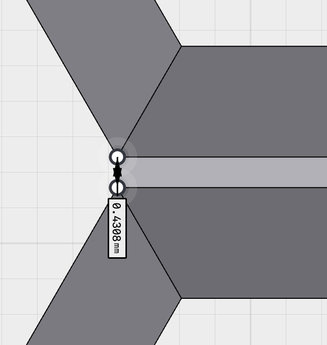
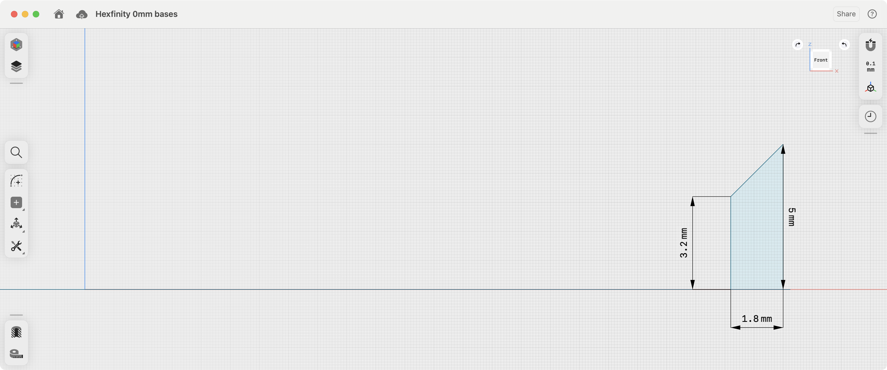
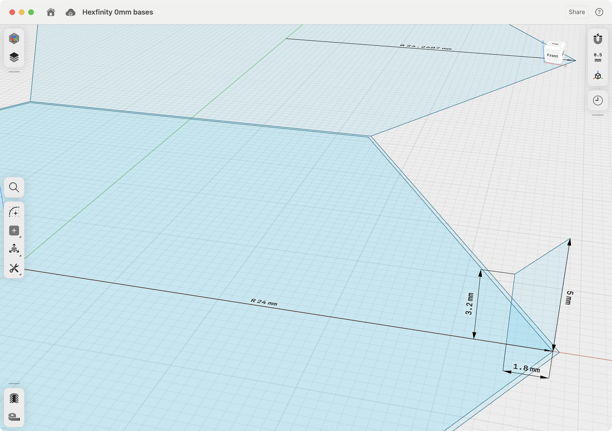
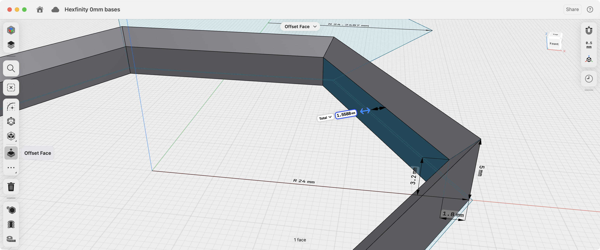
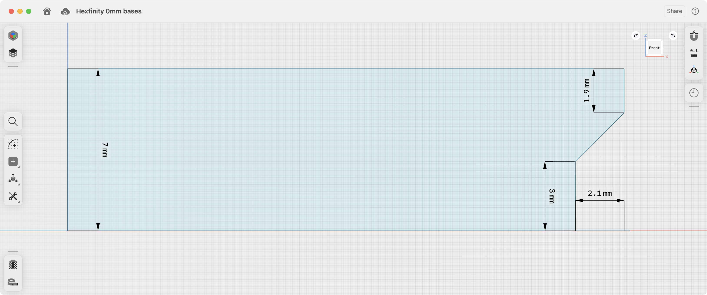
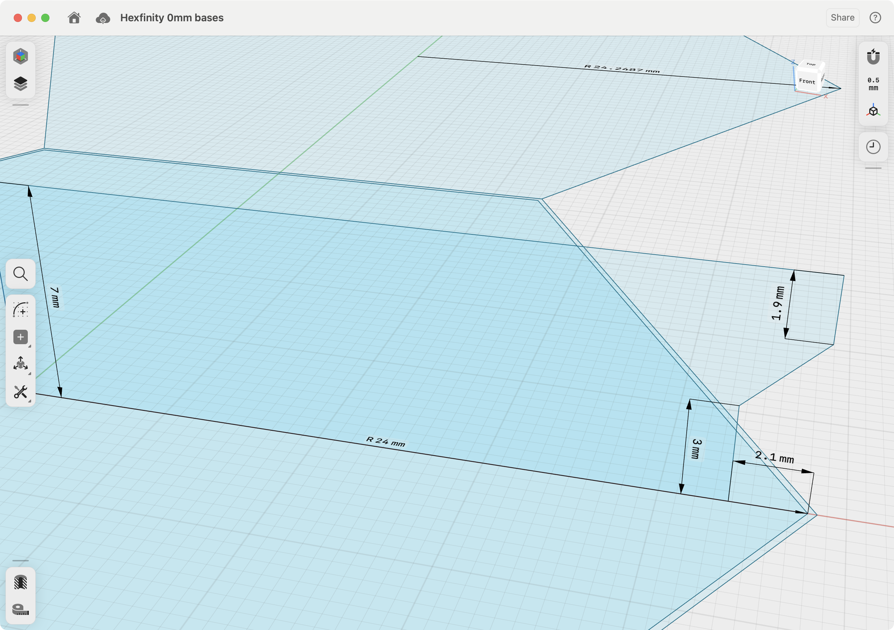
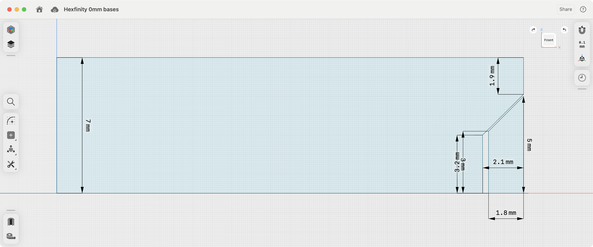
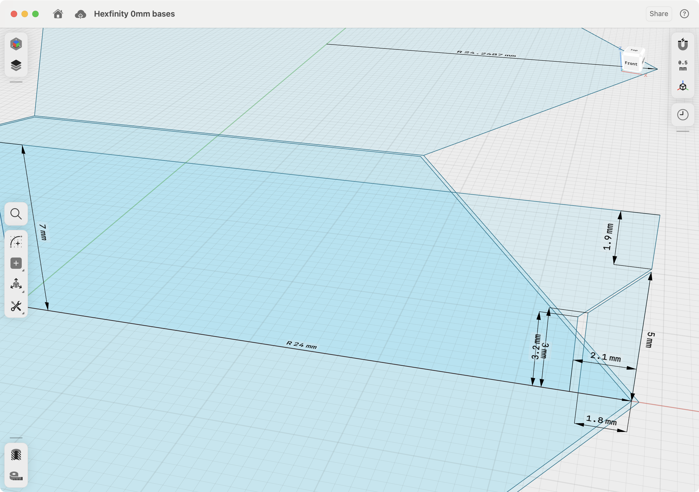

# Hexfinity Specification

## The Hexfinity Grid - with Max Gridfinity Compatibility

Inspired by the Gridfinity, I started with the core gridfinity design principles:

- **42mm**: Flat-to-flat width of the hex grid(Y-repetition distance `yRep = 42mm`)
- **7mm**: Height increments

But since I'm using regular hexagons, the above dimensions imply some decidedly non-gridfinity dimensions. But what are you going to do? Hexes are just better than squares!

- **48.4974mm:** hex grid diameter (X-repetition distance `xRep = yRep / cos(π \* 30 / 180)`)
- **24.2487mm:** hex grid radius IS the tiling hex edge length (because, hexagons are the bestagons!) (`xRep / 2`)
- **12.1244mm:** 1/2 edge (`hRep / 2`)
- **36.3731mm:** 3/2 edge lengths (`3 * hRep / 2`)
- **72.7461mm:** 3 edge lengths (`3 * hRep`)

## Hexfinity Tiles (and Bricks)

While hexfinity grid defines our infinite tiling of the plane, in the real world our tiles need some clearance to fit together. To keep things easy, I also started with some nice round values:

- **48mm:** hex tile diameter
- **24mm:** hex tile radius

But that in turn implies these hex-tacular numbers:

- **41.5692:** flat-to-flat width of a hex tile

## Inter-tile Clearance

Which means the clearance between two flat tile edges is:

- **0.4308mm:** tile flat-edge-to-flat-edge clearance `42mm - 41.5692mm`
- **0.2154mm:** half the clearance `0.4308mm / 2`

- 

## Interlock

The interlock is the key to making the tiles fit together. Inspired by the Gridfinity interlock, I designed a simple interlock that fits together with a bit of clearance. The "outer" interlock rises up from the top of a tile 5mm and wraps around the "inner" interlock of the tile above. Another way to think about it is the "inner" interlock is cut out of the bottom of tile tile while the "outer" interlock is added to the top of the tile. Or, the "outer" interlock is the tongue and the "inner" interlock is the grove.

### Outer Interlock

- **Outer Interlock "tongue"** (extends on top of a tile)

  - **Profile at Hexagon _Corners_**
    - **1.8mm** thick at corners of the hexagon (**X-dimension**)
    - **5mm** outer height (**Z-dimension**)
    - **3.2mm** inner height (**Z-dimension**)
  - **1.5588mm** effective thickness of the interlock along edges of the edges of the hexagon (sin(π/3) \* 1.8)

- Outer interlock profile: 
- Outer interlock profile perspective: 
- Outer interlock thickness: 

### Inner Interlock

- **Inner Interlock "grove"** (cut out of the bottom of a tile)

  - **Profile at Hexagon Corner**
    - **2.1mm** thick at corners of the hexagon
    - **3mm** inner height (**Z-dimension**)
    - **5.1mm** outer height (**Z-dimension**)
  - **1.8187mm** thick along edges of the hexagon (sin(π/3) \* 2.1)

- Inner interlock profile: 
- Inner interlock profile perspective: 
- Inner interlock thickness: 

### Both Inner and Outer Interlock

Here you can see how they fit together.

- Interlock profile both: 
- Interlock profile both perspective: 
