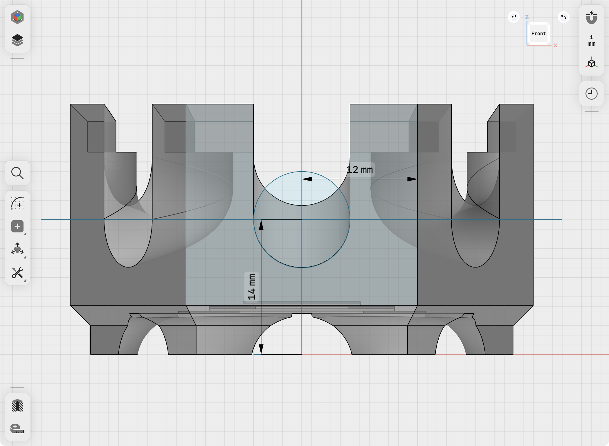
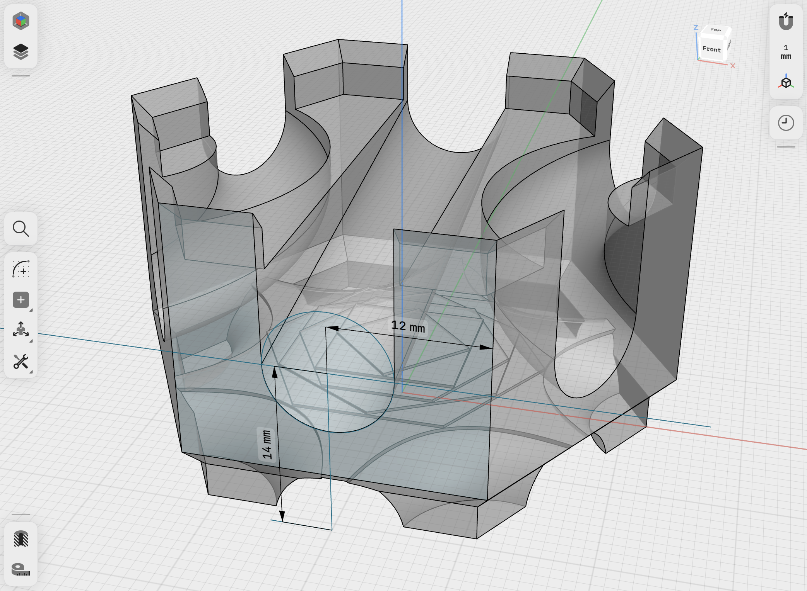
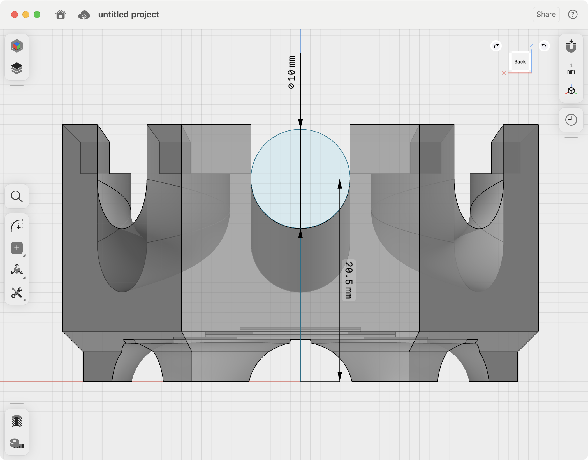
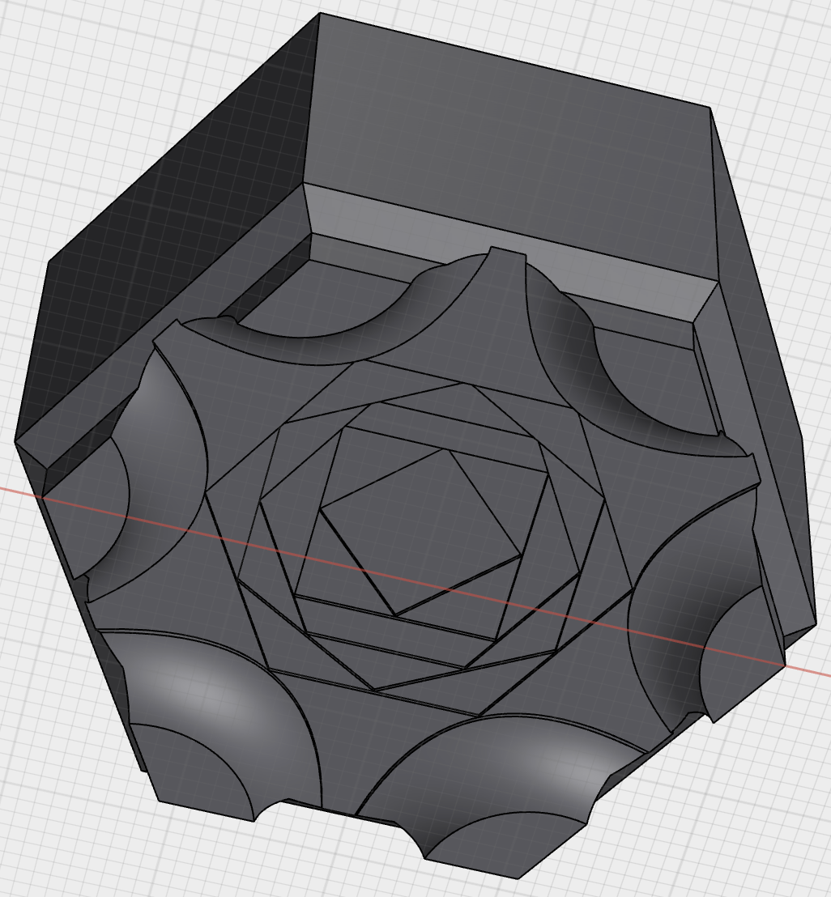
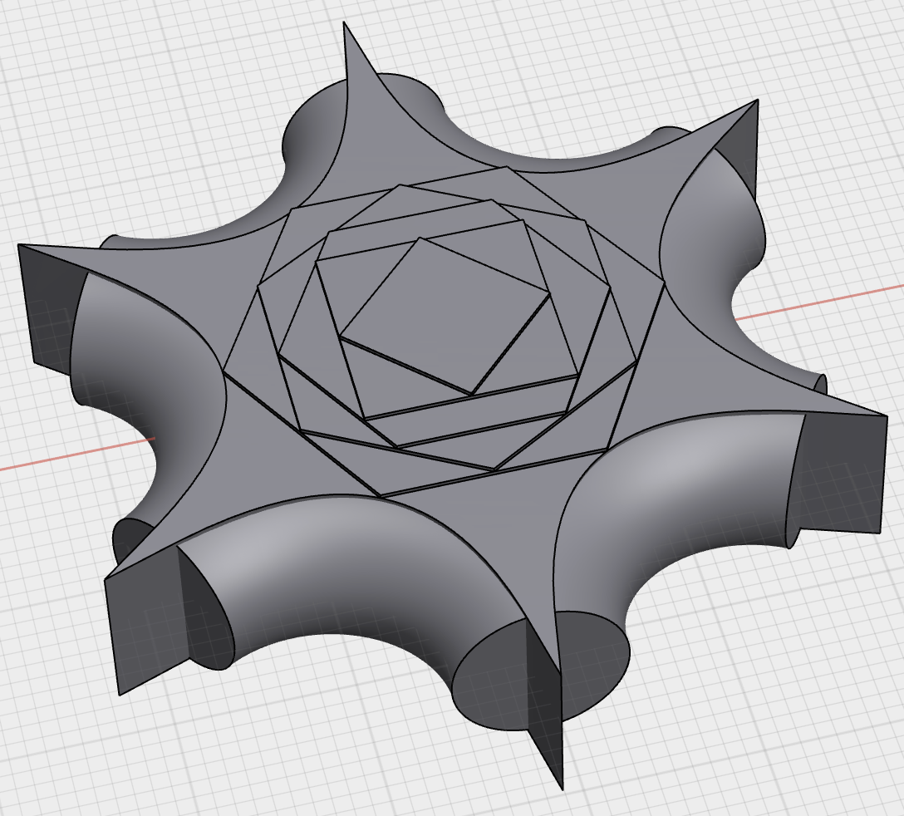

# Roll Hexfinity - Infinite Ball Rolling System

- See the [Hexfinity Specification](./HEXFINITY.md) for the core principles of the Hexfinity ecosystem.

## Tiles, Plates and Bricks: 3x Plates == 1x Bricks (same as LEGO)

Roll Hexfinity uses the Hexfinity system, and it leverages the interlock and stainability. For easy reference, we'll use the analogy of LEGO to describe the system:

- **tile:** any placable piece in the hexfinity system
- **plate:** a 7mm hexfinity tile
- **brick:** a 21mm hexfinity tile (3x plates)

## Roll Hexfinity Tiles

Just want to print and play? Find all the models you need:

- Roll Hexfinity: [models/roll-hexfinity](./models/roll-hexfinity)
- Hexfinity Bases: [models/hexfinity-bases](./models/hexfinity-bases)
- Hexfinity Plates: [models/hexfinity-plates](./models/hexfinity-plates)

Want to customize and make your own?

- Hexfinity Reference Tiles: [models/hexfinity-reference-tiles](./models/hexfinity-reference-tiles)
- Roll Hexfinity cut-outs: [models/roll-hexfinity-cut-outs](./models/roll-hexfinity-cut-outs)

## The Roll Hexfinity Hex-to-Hex Interface System

Given the basics of Hexfinity, the key to Roll Hexfinity is how balls roll from one brick to the next:

1. **8mm:** ball diameter
2. **10mm:** ball path diameter

The center of ball paths enter and exit tiles in the center of an edge and at heights which are a multiple of 7mm from the base of the tile. The standard 3-path brick has 3 entrances at 21mm and 3 exists at 14mm:

- Example exit from the 3-path brick (ortho view): 
- Example exit from the 3-path brick (perspective view): 

## Roll Hexfinity Clearance Trick

To make it easy for balls to roll from one brick to the next, we slightly alter the hex-to-hex interface: we lower entrances by 0.5mm. That way if two adjacent bricks are slightly misaligned, the ball will roll smoothly down to the next brick.

- Example entrance: 

## The Roll Hexfinity Tunnel-Compatible Base

What's up with the bottom of the brick?

The last, and trickiest part of the Roll Hexfinity system is the tunnel-compatible base. We need to achieve the following:

1. Roll-hexfinity tiles can be stacked without preventing balls from rolling through the tile underneath.
2. This thing needs to be 3D printable!
3. Oh, and we want it to look good :).

The first is pretty easy - we just need a clear path between every two edges of the underside of the tile. But this creates a large void in the center of the tile which 3D printers have a hard time bridging. Therefor I engineered a seemingly complex, but effective cut-out that gives the slicer the right hints to build up a bridge in layers. Last, I noticed when stacking tiles that this cut-out was visible when it didn't need to be. So, I moved the cut-out down 1mm to hide it without sacrificing the goals #1 and #2.

- Bridging cut-out: 
